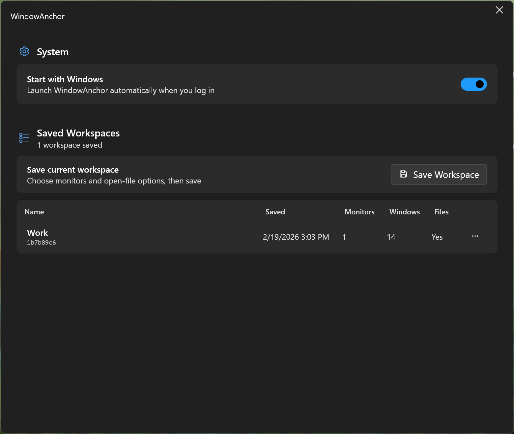
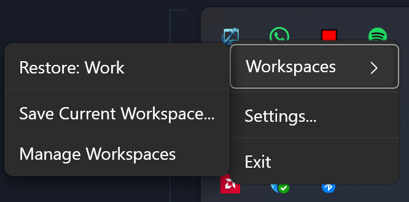

# WindowAnchor ⚓

**WindowAnchor** is a modern, Fluent-designed window management utility for Windows 11. It allows you to capture your entire workspace — including window positions, sizes, and even open files — and restore them with a single click or automatically when your monitor configuration changes.

[](https://www.virustotal.com/gui/file/b758f3e749e9884e6be18d0d62f4ac0bd6061f56560c3816be0f950abe6cd9ba/detection)

<!-- [IMAGE: Main Settings Window showcasing modern Fluent UI] -->


##  Key Features

- **Workspace Snapshots**: Save your complete desktop layout, including multi-head setups.
- **Selective Window Save**: Choose exactly which windows to include via a per-window checkbox list — password managers and incognito windows are excluded by default.
- **Deep File Detection**:
    - **Tier 1**: Recovers open files via window title parsing.
    - **Tier 2**: Uses Windows Jump-List integration to accurately identify and relaunch specific documents in supported apps (Office, VS Code, etc.).
- **Selective Restore**: Choose exactly which monitors to restore via a picker dialog.
- **Default Workspace & Startup Restore**: Set a default workspace to auto-restore on launch, restore the last-used one, or choose from a picker dialog.
- **Global Keyboard Shortcuts**: Customisable hotkeys for quick save, restore, workspace switching (Ctrl+Alt+1/2/3) and settings.
- **Workspace Ordering**: Reorder workspaces with Move Up/Down — the first three map to the hotkey slots.
- **Browser Session Restore**: Chromium browsers (Chrome, Edge, Opera, Brave) reopen with previous tabs via `--restore-last-session`.
- **Save Progress Transparency**: A dedicated progress window tracks the discovery of file paths and jump-lists during the save process.
- **Zero Dependencies**: Available as a high-performance, single-file standalone executable.
- **Fluent UI**: Fully integrated with the Windows 11 design language and system tray.

<!-- [GIF: Tray menu interaction - Saving a new Workspace] -->


##  The Core Workflow

WindowAnchor operates silently in your system tray, watching your display configuration. Using **Monitor Fingerprinting**, it identifies your current setup (e.g., "Home Office" vs. "Travel") and restores your preferred layout instantly.

1. **Download**: Get the latest `WindowAnchor-v1.2.0.exe` from the [Releases](../../releases) page.
2. **Save**: Right-click the tray icon and select "Save Workspace...".
3. **Restore**: Simply dock your laptop; WindowAnchor handles the rest.

## 🛠 How It Works

1. **Monitor fingerprint** — WindowAnchor computes a stable SHA-256 hash of your connected monitors. This is used to automatically match workspaces when you reconnect monitors.

2. **Window snapshot** — Enumerates visible windows, recording position, DPI, and process info. File detection parses window titles and queries Windows jump-lists to relaunch files.

3. **Restore phases** — Closed apps are re-launched with saved file arguments, then the coordinator waits for windows to spawn before applying final positions and states.

## Docs & Architecture

For a deep dive into how WindowAnchor handles monitor fingerprints, DPI-aware restoration, and Tier 1/2 file detection, check out:
- [**Architecture Overview**](docs/architecture.md) — A technical breakdown of the services and data flow.

## Contributing

Contributions are what make the open-source community such an amazing place to learn, inspire, and create.
Please check the [**Contributing Guidelines**](CONTRIBUTING.md) before submitting a Pull Request.

## Building

**Prerequisites:** .NET 8.0 SDK.

**Build Standalone:**
```powershell
dotnet publish src/WindowAnchor/WindowAnchor.csproj -c Release -r win-x64 --self-contained true -p:PublishSingleFile=true -p:PublishReadyToRun=true
```

## Star History

[](https://star-history.com/#marvintrvl/WindowAnchor&Date)

##  Roadmap

### v1.2 (Current Release) — *Stability & Control* ✅
- **Selective Window Save**: A checkbox list to choose exactly which windows get saved (exclude private/temporary windows).
- **Default Workspace**: Configure a default workspace to load on startup or via hotkey.
- **Keyboard Shortcuts**: Customisable global hotkeys for quick save, restore, and workspace switching.
- **Workspace Ordering**: Reorder workspaces, see slot numbers (#1–#3), and set a default from the context menu.
- **Browser Session Restore**: Chromium browsers (Chrome, Edge, Opera, Brave) restore previous tabs on launch.

### v1.3 (Next Release) — *UX Refinements*
- **Monitor Renaming**: Personalise "Generic PnP" monitors with custom names like "Left Monitor".
- **Switch Workspace**: Instantly switch between contexts by closing current apps and opening a different workspace.
- **Smart VS Code Tracking**: Deep detection of `.code-workspace` files for perfect dev-environment restoration.
- **Firefox Session Restore**: CLI-based session restore for Firefox.

### v1.4+ — *Power User Features*
- **Workspace Scheduler**: Automatically switch workspaces based on time of day or calendar events.
- **Per-App Launch Rules**: Define global rules for apps (e.g., "Always launch Slack on Monitor 2").
- **Workspace Templates**: Pre-made community-driven templates for developers, creators, and students.

### v2.0 & Beyond
- **Browser Extension**: Deep tab-level restoration via dedicated Chrome/Edge/Firefox extensions.
- **Cloud Sync**: Sync your workspace configurations across multiple devices.

##  License
This project is licensed under the MIT License.
