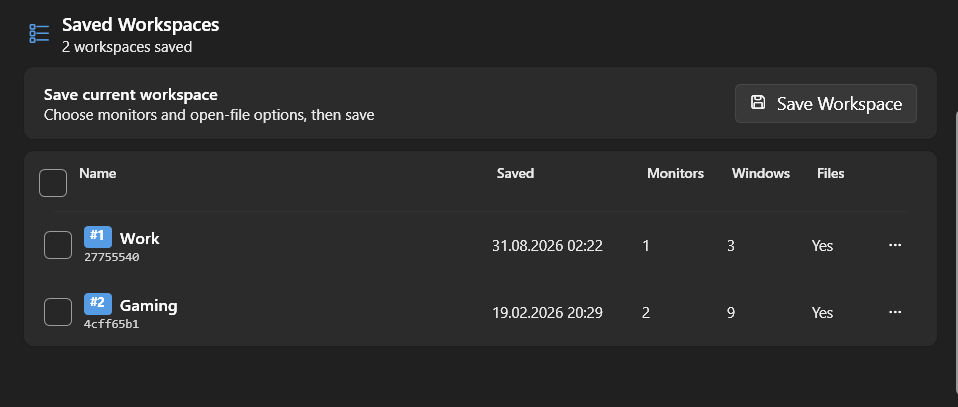
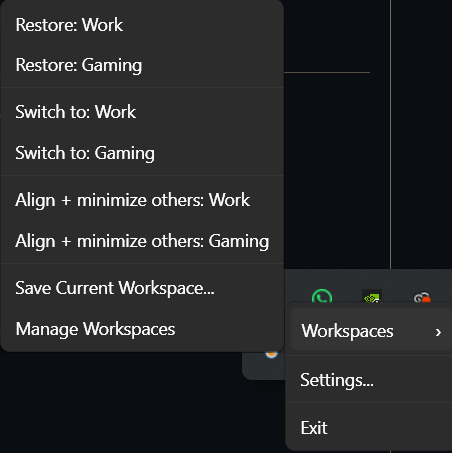
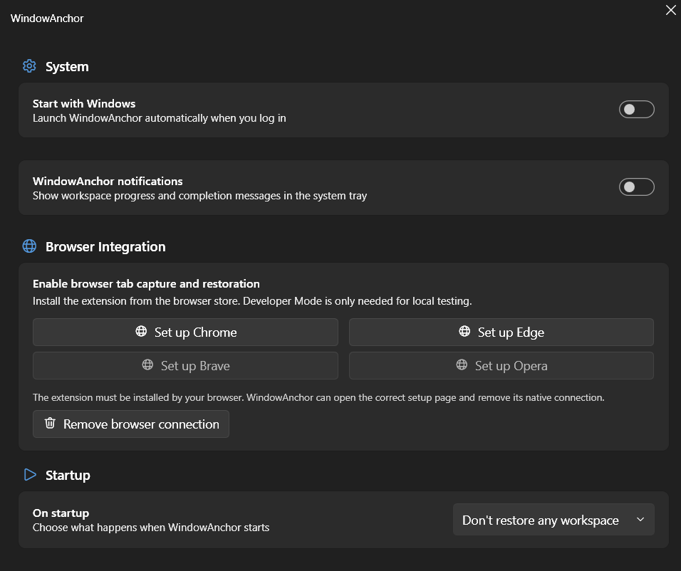
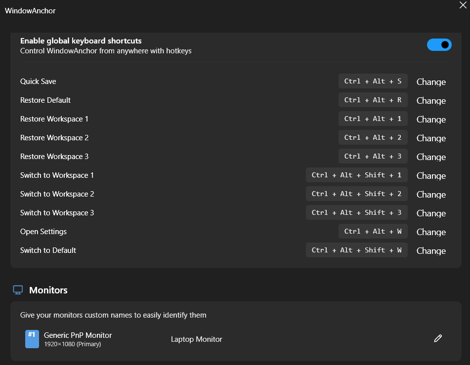

# WindowAnchor ⚓

**WindowAnchor** is a modern, Fluent-designed window management utility for Windows 11. It allows you to capture your entire workspace — including window positions, sizes, and even open files — and restore them with a single click or automatically when your monitor configuration changes.

[](../../releases/latest)



##  Key Features

- **Workspace Snapshots**: Save your complete desktop layout, including multi-head setups.
- **Selective Window Save**: Choose exactly which windows to include via a per-window checkbox list — password managers and incognito windows are excluded by default.
- **Deep File Detection**:
    - **Tier 1**: Recovers open files via window title parsing.
    - **Tier 2**: Uses Windows Jump-List integration to accurately identify and relaunch specific documents in supported apps (Office, VS Code, etc.).
- **Selective Restore**: Choose exactly which monitors to restore via a picker dialog.
- **Restore Plan Preview**: Review exact, adapted, ambiguous, missing, launch, move, skip, and minimize outcomes before a manual restore; disable individual entries before approval.
- **Default Workspace & Startup Restore**: Set a default workspace to auto-restore on launch, restore the last-used one, or choose from a picker dialog.
- **Global Keyboard Shortcuts**: Customisable hotkeys for quick save, restore, workspace switching (Ctrl+Alt+1/2/3), switch workspace (Ctrl+Alt+Shift+1/2/3) and settings.
- **Workspace Ordering**: Reorder workspaces with Move Up/Down — the first three map to the hotkey slots.
- **Monitor Renaming**: Assign custom names to monitors (e.g. “Left”, “Ultrawide”) — aliases replace hardware names throughout all dialogs.
- **Switch Workspace**: Instantly switch contexts by closing all open windows and restoring a different workspace — via context menu, tray, or hotkey.
- **Browser Session Restore**: The optional Chromium connector captures and restores supported tabs,
  groups, pinned/active state, and browser-window geometry; ordinary browser launch remains the
  graceful fallback when the connector is unavailable.
- **Save Progress Transparency**: A dedicated progress window tracks the discovery of file paths and jump-lists during the save process.
- **Zero Dependencies**: Available as a high-performance, single-file standalone executable.
- **Fluent UI**: Fully integrated with the Windows 11 design language and system tray.



##  The Core Workflow

WindowAnchor operates silently in your system tray, watching your display configuration. Using **Monitor Fingerprinting**, it identifies your current setup (e.g., "Home Office" vs. "Travel") and restores your preferred layout instantly.

1. **Download**: Get the latest Windows executable from the [Releases](../../releases) page.
2. **Save**: Right-click the tray icon and select "Save Workspace...".
3. **Restore**: Choose a workspace to review and approve its plan, or simply dock your laptop for
   the configured automatic one-click restore.

## Settings at a Glance

Configure Windows startup behavior, notifications, browser integration, and automatic workspace
restore from one place.



Customize global keyboard shortcuts and assign recognizable names to connected monitors.



## Review Status & Manual Install

The browser extension is currently under review for the Chrome Web Store. While review is in progress, the extension can still be used locally via manual installation.

### Local desktop app install
1. Download the latest versioned `WindowAnchor-v*.exe` from the GitHub release page and verify it
   against `SHA256SUMS.txt`.
2. Run the executable once to confirm the app starts correctly.
3. If Windows prompts for security permissions, allow the app to run.

### Manual browser extension install
1. Download the browser connector package from the GitHub release assets.
2. Open `chrome://extensions` or `edge://extensions` and enable **Developer mode**.
3. Click **Load unpacked** and select the extracted browser extension folder.
4. Copy the generated extension ID shown on the extension card.
5. Update the native host manifest and register the native messaging host for Chrome or Edge using the included PowerShell script.
6. Reload the extension and verify that it can capture and restore tabs.

For local testing, the included script is the recommended setup path:
```powershell
powershell -ExecutionPolicy Bypass -File .\register-native-host.ps1 -ExtensionId <id> -WindowAnchorPath <path-to-exe>
```

This manual workflow is fully supported for local testing while the extension is being reviewed.

## 🛠 How It Works

1. **Monitor fingerprint** — WindowAnchor computes a stable SHA-256 hash of your connected monitors. This is used to automatically match workspaces when you reconnect monitors.

2. **Window snapshot** — Enumerates visible windows, recording position, DPI, and process info. File detection parses window titles and queries Windows jump-lists to relaunch files.

3. **Plan and approve** — Manual tray and Settings restores show an immutable preview. You can
   disable entries, use Tab to navigate, Enter to approve, and Escape to cancel. The approved plan
   is checked for stale windows, browser capability, and launch resources before any action starts.

4. **Execute and report** — The executor launches only approved targets, reconciles appearing
   windows, applies final DPI-aware positions/states, and returns structured per-item outcomes.

## Docs & Architecture

For a deep dive into how WindowAnchor handles monitor fingerprints, DPI-aware restoration, and Tier 1/2 file detection, check out:
- [**Architecture Overview**](docs/architecture.md) — A technical breakdown of the services and data flow.

## Contributing

Contributions are what make the open-source community such an amazing place to learn, inspire, and create.
Please check the [**Contributing Guidelines**](CONTRIBUTING.md) before submitting a Pull Request.

## Building

**Prerequisites:** .NET 8.0 SDK.

**Build Standalone:**
```powershell
dotnet publish src/WindowAnchor/WindowAnchor.csproj -c Release -r win-x64 --self-contained true -p:PublishSingleFile=true -p:PublishReadyToRun=true
```

See [build.md](build.md) for clean builds, Release tests, packaging, and checksum generation. Each
published release includes `SHA256SUMS.txt` for its executable and browser connector.

## Star History

[](https://star-history.com/#marvintrvl/WindowAnchor&Date)

##  Roadmap

### v1.5.0 (Current Release) — *Restore Planning and Safety* ✅
- **Plan Before Restore**: Manual tray and Settings restores show every planned entry outcome and action before execution.
- **Per-Entry Approval**: Disable entries without recomputing or mutating the original preview.
- **Stale-Plan Protection**: Changed HWNDs, candidate inventories, browser capability, and launch resources stop execution with a clear warning.
- **Stable Data Foundation**: Versioned schemas, stable IDs, atomic typed stores, and privacy-safe structured diagnostics.
- **Deterministic Matching**: Shared identity evidence protects PWA, dedicated-browser, document, packaged-app, and duplicate-window behavior.

### v1.3 — *UX Improvements* ✅
- **Monitor Renaming**: Personalise monitor names ("Generic PnP" → "Left Monitor") in Settings → Monitors.
- **Switch Workspace**: Instant context switch — closes all windows and restores a different workspace.
- **Switch Default hotkey**: Ctrl+Alt+Shift+W switches to the default workspace in one keystroke.
- **Switch Slot hotkeys**: Ctrl+Alt+Shift+1/2/3 switch to workspace slots 1, 2, and 3 (close-everything-first variant of the Restore hotkeys).

### v1.2 — *Stability & Control* ✅
- Selective Window Save, Default Workspace, Keyboard Shortcuts, Workspace Ordering, Browser Session Restore.

### v1.6 (Next Release) — *Restore Intelligence*
- **Confidence and Ambiguity Resolution**: Explain close matches and let users choose without destructive guessing.
- **Application Readiness**: Replace compatibility delays with cancellable per-entry readiness signals.
- **Restore Reports**: Present structured action and entry outcomes after execution.
- **Topology Stabilization**: Avoid restoring against transient monitor states while docking.

### v1.6+ — *Recovery and Adaptation*
- **Semantic Layouts**: Adapt saved intent across monitor sizes, orientations, and DPI.
- **Workspace Health and Diff**: Inspect missing resources and current-vs-saved differences without mutation.
- **Checkpoints and Quick Captures**: Add recovery retention and temporary workspace saves on top of the isolated stores.

### v2.0 & Beyond
- **Portability**: Logical path aliases, workspace import/export, and cross-device monitor identity.
- **Sync and Ecosystem**: Provider-neutral folder sync, catalog metadata, desk profiles, and templates.

##  License
This project is licensed under the MIT License.
