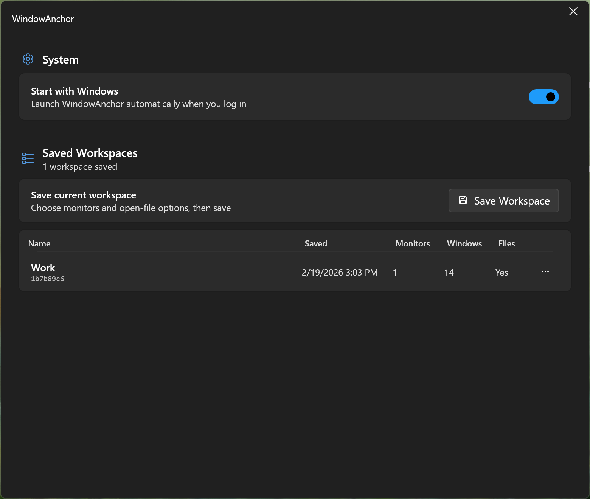
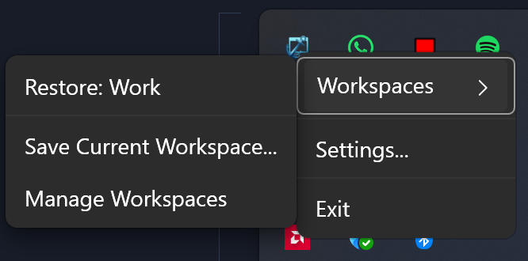

# WindowAnchor ⚓

**WindowAnchor** is a modern, Fluent-designed window management utility for Windows 11. It allows you to capture your entire workspace — including window positions, sizes, and even open files — and restore them with a single click or automatically when your monitor configuration changes.

[](https://www.virustotal.com/gui/file/b758f3e749e9884e6be18d0d62f4ac0bd6061f56560c3816be0f950abe6cd9ba/detection)

<!-- [IMAGE: Main Settings Window showcasing modern Fluent UI] -->


##  Key Features

- **Workspace Snapshots**: Save your complete desktop layout, including multi-head setups.
- **Selective Window Save**: Choose exactly which windows to include via a per-window checkbox list — password managers and incognito windows are excluded by default.
- **Deep File Detection**:
    - **Tier 1**: Recovers open files via window title parsing.
    - **Tier 2**: Uses Windows Jump-List integration to accurately identify and relaunch specific documents in supported apps (Office, VS Code, etc.).
- **Selective Restore**: Choose exactly which monitors to restore via a picker dialog.
- **Default Workspace & Startup Restore**: Set a default workspace to auto-restore on launch, restore the last-used one, or choose from a picker dialog.
- **Global Keyboard Shortcuts**: Customisable hotkeys for quick save, restore, workspace switching (Ctrl+Alt+1/2/3), switch workspace (Ctrl+Alt+Shift+1/2/3) and settings.
- **Workspace Ordering**: Reorder workspaces with Move Up/Down — the first three map to the hotkey slots.
- **Monitor Renaming**: Assign custom names to monitors (e.g. “Left”, “Ultrawide”) — aliases replace hardware names throughout all dialogs.
- **Switch Workspace**: Instantly switch contexts by closing all open windows and restoring a different workspace — via context menu, tray, or hotkey.
- **Browser Session Restore**: Chromium browsers (Chrome, Edge, Opera, Brave) reopen with previous tabs via `--restore-last-session`.
- **Save Progress Transparency**: A dedicated progress window tracks the discovery of file paths and jump-lists during the save process.
- **Zero Dependencies**: Available as a high-performance, single-file standalone executable.
- **Fluent UI**: Fully integrated with the Windows 11 design language and system tray.

<!-- [GIF: Tray menu interaction - Saving a new Workspace] -->


##  The Core Workflow

WindowAnchor operates silently in your system tray, watching your display configuration. Using **Monitor Fingerprinting**, it identifies your current setup (e.g., "Home Office" vs. "Travel") and restores your preferred layout instantly.

1. **Download**: Get the latest Windows executable from the [Releases](../../releases) page.
2. **Save**: Right-click the tray icon and select "Save Workspace...".
3. **Restore**: Simply dock your laptop; WindowAnchor handles the rest.

## Review Status & Manual Install

The browser extension is currently under review for the Chrome Web Store. While review is in progress, the extension can still be used locally via manual installation.

### Local desktop app install
1. Download the latest `WindowAnchor.exe` from the GitHub release page.
2. Run the executable once to confirm the app starts correctly.
3. If Windows prompts for security permissions, allow the app to run.

### Manual browser extension install
1. Download the browser connector package from the GitHub release assets.
2. Open `chrome://extensions` or `edge://extensions` and enable **Developer mode**.
3. Click **Load unpacked** and select the extracted browser extension folder.
4. Copy the generated extension ID shown on the extension card.
5. Update the native host manifest and register the native messaging host for Chrome or Edge using the included PowerShell script.
6. Reload the extension and verify that it can capture and restore tabs.

For local testing, the included script is the recommended setup path:
```powershell
powershell -ExecutionPolicy Bypass -File .\register-native-host.ps1 -ExtensionId <id> -WindowAnchorPath <path-to-exe>
```

This manual workflow is fully supported for local testing while the extension is being reviewed.

## 🛠 How It Works

1. **Monitor fingerprint** — WindowAnchor computes a stable SHA-256 hash of your connected monitors. This is used to automatically match workspaces when you reconnect monitors.

2. **Window snapshot** — Enumerates visible windows, recording position, DPI, and process info. File detection parses window titles and queries Windows jump-lists to relaunch files.

3. **Restore phases** — Closed apps are re-launched with saved file arguments, then the coordinator waits for windows to spawn before applying final positions and states.

## Docs & Architecture

For a deep dive into how WindowAnchor handles monitor fingerprints, DPI-aware restoration, and Tier 1/2 file detection, check out:
- [**Architecture Overview**](docs/architecture.md) — A technical breakdown of the services and data flow.

## Contributing

Contributions are what make the open-source community such an amazing place to learn, inspire, and create.
Please check the [**Contributing Guidelines**](CONTRIBUTING.md) before submitting a Pull Request.

## Building

**Prerequisites:** .NET 8.0 SDK.

**Build Standalone:**
```powershell
dotnet publish src/WindowAnchor/WindowAnchor.csproj -c Release -r win-x64 --self-contained true -p:PublishSingleFile=true -p:PublishReadyToRun=true
```

## Star History

[](https://star-history.com/#marvintrvl/WindowAnchor&Date)

##  Roadmap

### v1.4.1 (Current Release) — *Browser Integration & Reliability* ✅
- **Browser Connector**: Capture and restore supported Chromium tabs, pinned tabs, tab groups, and browser window bounds.
- **Browser Setup**: Guided local Chrome/Edge setup with native-host registration for manual testing.
- **Installed Web Apps**: Restore Chromium PWAs using their application identity instead of opening a plain browser window.
- **Reliable Releases**: Versioned Windows EXE and browser connector ZIP are attached to each GitHub release.

### v1.3 — *UX Improvements* ✅
- **Monitor Renaming**: Personalise monitor names ("Generic PnP" → "Left Monitor") in Settings → Monitors.
- **Switch Workspace**: Instant context switch — closes all windows and restores a different workspace.
- **Switch Default hotkey**: Ctrl+Alt+Shift+W switches to the default workspace in one keystroke.
- **Switch Slot hotkeys**: Ctrl+Alt+Shift+1/2/3 switch to workspace slots 1, 2, and 3 (close-everything-first variant of the Restore hotkeys).

### v1.2 — *Stability & Control* ✅
- Selective Window Save, Default Workspace, Keyboard Shortcuts, Workspace Ordering, Browser Session Restore.

### v1.5 (Next Release) — *Deeper Integration*
- **Smart VS Code Tracking**: Deep detection of `.code-workspace` files for perfect dev-environment restoration.
- **Firefox Session Restore**: CLI-based session restore for Firefox.

### v1.5+ — *Power User Features*
- **Workspace Scheduler**: Automatically switch workspaces based on time of day or calendar events.
- **Per-App Launch Rules**: Define global rules for apps (e.g., "Always launch Slack on Monitor 2").
- **Workspace Templates**: Pre-made community-driven templates for developers, creators, and students.

### v2.0 & Beyond
- **Browser Extension**: Deep tab-level restoration via dedicated Chrome/Edge/Firefox extensions.
- **Cloud Sync**: Sync your workspace configurations across multiple devices.

##  License
This project is licensed under the MIT License.
