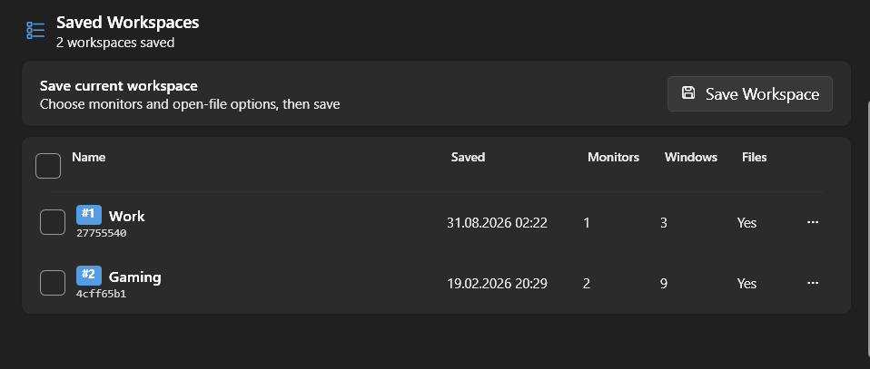
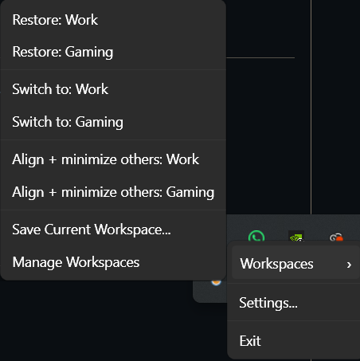
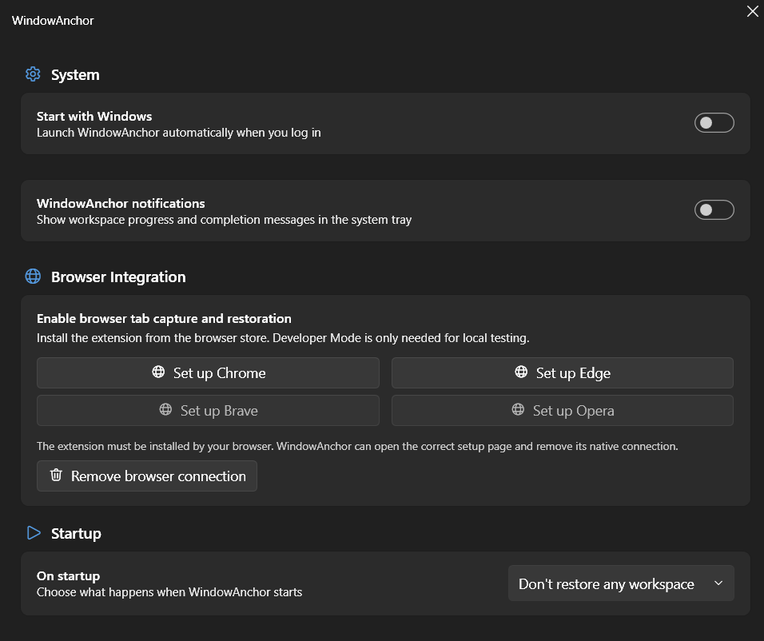
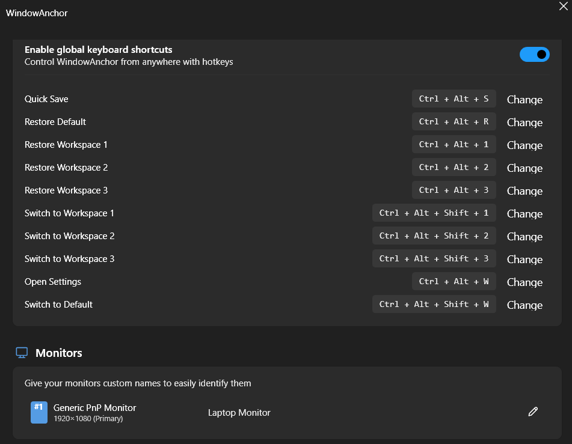

# WindowAnchor ⚓

**WindowAnchor** is a modern, Fluent-designed window management utility for Windows 11. It allows you to capture your entire workspace — including window positions, sizes, and even open files — and restore them with a single click or automatically when your monitor configuration changes.

[](https://github.com/marvintrvl/WindowAnchor/releases/latest)

This README describes the current development tree. Use the changelog and release notes to
distinguish unreleased behavior from the latest packaged release. The release badge above always
opens the latest published GitHub release.



##  Key Features

- **Workspace Snapshots**: Save your complete desktop layout, including multi-head setups.
- **Selective Window Save**: Choose exactly which windows to include via a per-window checkbox list — password managers and incognito windows are excluded by default.
- **Deep File Detection**:
    - **Tier 1**: Recovers open files via window title parsing.
    - **Tier 2**: Uses Windows Jump-List integration to accurately identify and relaunch specific documents in supported apps (Office, VS Code, etc.).
- **Selective Restore**: Choose exactly which monitors to restore via a picker dialog.
- **Explicit Restore Modes and Entry Policies**: Choose Repair, Move Existing, Resume, Launch
  Fresh, Exact Switch, or Preview Only. Each saved entry can inherit that mode or override it with
  reuse, launch-if-missing, always-launch-new, never-launch, never-close, or ignore-during-switch
  behavior. Existing workspaces default to the compatible Resume mode.
- **Explainable Match Resolution**: Close candidates are never guessed by HWND order. Restore
  Preview shows titles, app/class, monitor, bounds, confidence, score, and evidence so you can pick
  the correct window, optionally remember that composite identity, or skip the entry.
- **Application Readiness**: Launched apps are positioned only after their safely matched window is
  responsive and its identity and bounds are stable. Polling is cancellable, bounded per entry,
  and extensible through app-specific strategies.
- **Verified Window Placement**: After positioning, WindowAnchor re-reads normal bounds and state
  with DPI-aware tolerance. Apps that reject or override placement receive bounded same-HWND
  retries, with `Applied`, `Rejected`, `MovedByApp`, and `WindowGone` outcomes in the result.
- **Conditional Transactional Restore & Full Undo**: Routine Repair, Move Existing, and Resume
  restores skip recovery capture by default for lower latency and can opt in from Settings. Exact
  Switch and Undo always retain their checkpoint gate. “Undo Last Restore” reconciles the saved
  pre-restore desktop, including closing unrelated windows and creating an undo-of-undo point.
- **Optional Restore Preview**: Manual tray, Settings, and hotkey restores share one policy. The
  review dialog can be disabled for routine one-click restores; WindowAnchor still opens it when
  ambiguity or a blocking entry requires an explicit choice.
- **Update-Safe Store App Launching**: Versioned `WindowsApps` paths are rebound to the currently
  installed package and launched through their stable AppUserModelID, so Store/MSIX updates do not
  turn an otherwise valid workspace entry into a missing resource.
- **Update-Safe Squirrel App Launching**: Missing `app-&lt;version&gt;` executable paths are resolved
  inside a recognized Squirrel install root (for apps such as Discord channels). Resolution is
  limited to immediate version siblings with the same executable name—no user-defined wildcard.
- **Adaptive Semantic Layouts**: Saves exact pixels together with monitor work areas, DPI,
  normalized geometry, anchors, and recognizable full/half/third/centered layouts. Changed or
  missing monitors use the semantic representation and are clamped fully onto a visible work area.
  Visible DWM frame bounds are kept distinct from invisible resize borders so edge-aligned windows
  do not acquire the usual Windows 8-pixel inset after adaptation.
- **Stabilized Display Changes**: Dock/KVM event bursts share one cancellable topology stabilizer.
  Restore begins only after monitor identity, bounds, work area, DPI, primary state, and orientation
  remain unchanged for the settle interval; a timeout refuses to restore an unstable intermediate state.
- **Layout Variants**: One logical workspace can retain multiple topology-specific placement sets
  without copying its shared application, file, or browser context. Exact topology wins, then the
  variant with the strongest current-monitor overlap supplies adaptive placement.
- **VS Code Workspace Context**: A high-confidence `.code-workspace` file or project folder is
  captured separately from an open document. Restore uses VS Code's supported new-window or
  reuse-window CLI behavior, while Cursor retains its existing registered-handler fallback.
- **Windows 11 File Explorer Tabs**: When file/folder capture is enabled, each Explorer window
  retains all of its folder tabs and the active tab. Restore reconciles only missing tabs in the
  assigned Explorer window, preserves unrelated open tabs, and avoids duplicates on repeat runs.
- **Windows Terminal Tabs (WA-021, development tree)**: With "Save open files" enabled, the
  save dialog records each detected tab's profile and current directory. An optional PowerShell
  prompt integration pre-fills these values; otherwise confirm them in the tab editor. Restore
  opens the saved tabs together in a new Terminal window with their respective directories.
- **Default Workspace & Startup Restore**: Set a default workspace to auto-restore on launch, restore the last-used one, or choose from a picker dialog.
- **Global Keyboard Shortcuts**: Customisable hotkeys for quick save, restore, workspace switching (Ctrl+Alt+1/2/3), switch workspace (Ctrl+Alt+Shift+1/2/3) and settings.
- **Workspace Ordering**: Reorder workspaces with Move Up/Down — the first three map to the hotkey slots.
- **Monitor Renaming**: Assign custom names to monitors (e.g. “Left”, “Ultrawide”) — aliases replace hardware names throughout all dialogs.
- **Reviewed Workspace Switching**: Preview confidence, ambiguity, and monitor adaptation first.
  Approved destination windows stay open; only unrelated windows receive normal close requests,
  with bounded single-flight waiting and no force-close behavior. Expected closure of an
  unselected candidate does not invalidate the already-reviewed plan.
- **Keep Applications Open Globally**: Stable executable or AppUserModelID identities can inherit
  the existing never-close behavior across every workspace without title-based exceptions or a
  second placement policy.
- **Rescue Active Window**: After selecting a partly or fully off-screen window, use the tray
  command to move only that foreground window into the nearest reachable work area when it falls
  below the configured visible-area threshold. It does not restore a workspace, reopen apps, alter
  other windows, or unmaximize a maximized window.
- **Logical Path Aliases**: Map portable roots such as `${PROJECTS}` to a local directory. Captures
  retain the exact local path and add the most-specific matching alias; restore checks the exact
  path first and then the current device mapping.
- **Native Task-Window Filtering**: Workspace windows are selected from OS capabilities rather
  than application names: DWM-cloaked, tool-only, non-activatable, and owned/transient surfaces
  are not saved as independent tasks. `WS_EX_APPWINDOW` remains an
  explicit opt-in. Existing background/tray processes with no eligible task window are explained
  and skipped instead of being relaunched and awaited for 45 seconds.
- **Safe Multiplicity and Hosted Identity**: Distinct captured windows remain distinct; one HWND
  can satisfy only one entry, and an unavailable duplicate is reported rather than silently
  collapsed. Cross-process hosted windows match only through shared Windows identity such as an
  exact AppUserModelID within the same package family—not a process-name or title exception.
- **Browser Session Restore**: Optional, separately packaged Chromium and Firefox connectors
  capture and restore supported tabs, groups, pinned/active state, and browser-window geometry;
  ordinary browser launch remains the graceful fallback when a connector is unavailable.
- **Save Progress Transparency**: A dedicated progress window tracks the discovery of file paths and jump-lists during the save process.
- **Restore Progress Transparency**: Restore, switch, and undo show the active checkpoint,
  resource detection, browser, launch, readiness, close-wait, and placement-verification stage,
  including item counts, elapsed/limit timing, and safe cancellation.
- **Zero Dependencies**: Available as a high-performance, single-file standalone executable.
- **Fluent UI**: Fully integrated with the Windows 11 design language and system tray.
- **First-Run and Permanent In-App Guide**: A fresh interactive installation explains that
  WindowAnchor lives in the notification area and offers direct Save Workspace and Settings
  actions. The same Help & Guide window remains available from the tray and Settings, with a
  complete reference for restore modes, entry policies, matching, checkpoints, browser support,
  privacy, and operational limits.



##  The Core Workflow

WindowAnchor operates silently in your system tray, watching your display configuration. Using **Monitor Fingerprinting**, it identifies your current setup (e.g., "Home Office" vs. "Travel") and restores your preferred layout instantly.

1. **Download**: Get the Windows executable from the [latest GitHub release](https://github.com/marvintrvl/WindowAnchor/releases/latest) page.
2. **Get oriented**: On the first interactive launch, use the in-app guide to save a workspace or
   open Settings. Reopen it later with **Help & Guide** from the tray or Settings.
3. **Save**: Right-click the tray icon and select "Save Workspace...".
4. **Restore**: Choose a workspace to review and approve its plan, or simply dock your laptop for
   the configured automatic one-click restore.

## Settings at a Glance

Configure Windows startup behavior, notifications, browser integration, automatic workspace
restore, optional manual previews, optional routine recovery checkpoints, persistent applications,
logical path aliases, the active-window rescue threshold, and remembered window choices from one
place. Open a workspace’s “View & Edit Windows” dialog to set its default restore mode and the
policy for each saved entry; “Restore As” in the workspace menu runs any mode once without changing
that default. Recapturing a workspace with the same name preserves its configured mode and uniquely
matched entry policies. **Help & Guide** provides these explanations inside the app, so normal
operation does not require the GitHub documentation.



Customize global keyboard shortcuts and assign recognizable names to connected monitors.



## Windows Terminal integration

Windows Terminal does not provide an external live query for every tab's profile and current
directory ([Terminal feature request](https://github.com/microsoft/terminal/issues/19818)).
WindowAnchor detects visible tabs through accessibility, and its optional PowerShell
integration reports each tab's `WT_SESSION`, `WT_PROFILE_ID`, and file-system location at every
prompt. A short `[WA:...]` marker in the tab title associates that report with the right window
and tab. The integration is opt-in and does not install or change your PowerShell profile by itself.

To enable it after this feature is released, download
`WindowAnchor-Terminal-Integration-<version>.ps1` from the matching release
(or use [`scripts/WindowAnchor.Terminal.ps1`](scripts/WindowAnchor.Terminal.ps1) when running from
source), copy it to a stable location, then add this line at the *end* of the PowerShell profile
used by your Terminal tab (open that profile with `notepad $PROFILE`):

```powershell
. 'C:\path\to\WindowAnchor.Terminal.ps1'
```

Restart the tab. Its title should gain a `[WA:...]` marker; if it does not, check that Terminal's
profile does not enable `suppressApplicationTitle`. Windows PowerShell and PowerShell 7 have
separate `$PROFILE` files, so repeat for each shell you use. Removing that one profile line
disables future tracking; the integration does not delete your saved workspaces or session reports.

When saving, select the Terminal window and keep "Save open files" on. Use "Configure Terminal
tabs" to inspect the left-to-right tab list, correct any profile/directory, or add a tab if
accessibility did not expose it. Untracked cmd, WSL, or non-PowerShell tabs need manual values.
Each directory must exist at save time and again at restore time. This feature recreates tabs,
profiles, initial directories, and active-tab selection; it does not restore shell command history,
running programs, split panes, or arbitrary shell state. A PowerShell profile that calls
`Set-Location` on startup can override Terminal's requested starting directory; remove or adjust
that profile behavior if a restored tab still starts elsewhere. A running Terminal window may be reused
by Resume; use Launch Fresh when you explicitly want a separate copy of its saved tabs. Workspaces
saved by the earlier WA-021 prototype contain no trustworthy per-tab data and must be recaptured.
The restore command follows [Microsoft's `wt` command-line documentation](https://learn.microsoft.com/en-us/windows/terminal/command-line-arguments).

## Browser Connector

Install the [WindowAnchor Browser Connector from the Chrome Web Store](https://chromewebstore.google.com/detail/windowanchor-browser-conn/liiklnjpifhhmjncifbjjfgplonkkinh). In WindowAnchor, open **Settings > Browser Integration > Set Up Chrome**: the app registers its current-user native host and opens this store listing in Chrome.

Firefox Desktop 142+ is supported by the separate AMO-ready package in
[`firefox-extension/`](firefox-extension/). **Set Up Firefox** registers Mozilla's current-user
native host and opens the AMO search page while the public listing is pending. Local testing and
the exact AMO validation/signing workflow are documented in the package README; normal Firefox
Release/Beta installations require Mozilla's signed add-on.

Browser sessions stay profile-aware: an opaque local connector key keeps matching-tab reuse inside
the same browser profile. Settings lets you reuse exact matching tabs, always reopen them, or leave
matches for review; `file://` tabs always reopen separately.

### Local desktop app install
1. Download the Windows executable from the [latest GitHub release](https://github.com/marvintrvl/WindowAnchor/releases/latest) and verify it against that release's `SHA256SUMS.txt`.
2. Run the executable once to confirm the app starts correctly.
3. If Windows prompts for security permissions, allow the app to run.

### Local extension development

Unpacked installation is reserved for contributor testing. Load `browser-extension/` from `chrome://extensions` with Developer mode enabled, then register its development ID with the included script:
```powershell
powershell -ExecutionPolicy Bypass -File .\register-native-host.ps1 -ExtensionId <id> -WindowAnchorPath <path-to-exe>
```

The development ID differs from the published Chrome Web Store ID.

## 🛠 How It Works

1. **Monitor fingerprint** — WindowAnchor computes a stable SHA-256 hash of your connected monitors. This is used to automatically match workspaces when you reconnect monitors.

2. **Window snapshot** — Enumerates visible windows, recording exact normal bounds, monitor/work-area
   geometry, DPI, normalized anchors, semantic layout, and process info. File detection parses
   window titles and queries Windows jump-lists to relaunch files.

3. **Choose policy, then plan and optionally approve** — The workspace mode and each entry’s
   persisted override are resolved once by the pure planner. Manual tray, Settings, and hotkey
   commands build the same immutable plan. With Restore Preview enabled, you can see the selected
   mode and applied policies, resolve candidates, remember a choice,
   disable entries, use Tab to navigate, Enter to approve, and Escape to cancel. When preview is
   disabled, executable plans continue immediately; plans needing an explicit decision still open
   the dialog. Every approved plan is checked for stale windows, browser capability, and launch
   resources before an action starts.

   Repair changes only mismatched existing placements; Move Existing never launches; Resume
   reuses or launches; Launch Fresh requests a distinct window only where a reliable contract is
   available; Exact Switch closes unrelated context normally; Preview Only cannot reach a mutation
   boundary. Unsupported fresh-instance requests are reported and reuse the safest match.

4. **Conditional checkpoint** — Routine non-destructive restores skip capture by default; the
   Settings opt-in enables a fast metadata-only checkpoint. Exact Switch and Undo always require
   one before the first close or replacement mutation. It retains title, Explorer-folder, PWA, and
   browser metadata, but skips Jump List parsing and recursive folder scans. A failed required
   checkpoint blocks mutation, while a skipped routine checkpoint still uses the same serialized
   execution gate.

5. **Execute and report** — The executor launches only approved targets, polls process/window
   readiness against a 45-second real wall-clock limit instead of sleeping for fixed intervals,
   and starts a wait only when a successful launch/browser action is related to that entry. It applies final DPI-aware positions/states as
   each entry becomes ready, then verifies the observed placement and performs at most two
   same-HWND corrections. A dedicated final Explorer phase restores missing saved folder tabs in
   the revalidated assigned window and reselects the saved active tab. Structured per-item outcomes
   include readiness, verification, retry count, tolerance, and final failure state.

## Docs & Architecture

For a deep dive into how WindowAnchor handles monitor fingerprints, DPI-aware restoration, and Tier 1/2 file detection, check out:
- [**Architecture Overview**](docs/architecture.md) — A technical breakdown of the services and data flow.
- [**Implementation Status**](docs/implementation-status.md) — Verified ticket coverage, remaining
  manual gates, and deliberately incomplete portability/sync work.
- [**Restore Simulation**](docs/restore-simulation.md) — Run deterministic planner fixtures without
  enumerating or changing the live desktop.

## Contributing

Contributions are what make the open-source community such an amazing place to learn, inspire, and create.
Please check the [**Contributing Guidelines**](CONTRIBUTING.md) before submitting a Pull Request.

## Building

**Prerequisites:** .NET 8.0 SDK.

**Build Standalone:**
```powershell
dotnet publish src/WindowAnchor/WindowAnchor.csproj -c Release -r win-x64 --self-contained true -p:PublishSingleFile=true -p:PublishReadyToRun=true
```

See [build.md](build.md) for clean builds, Release tests, packaging, and checksum generation. Each
published release includes `SHA256SUMS.txt` for its executable, Chromium connector, and AMO
submission package.

## Star History

[](https://star-history.com/#marvintrvl/WindowAnchor&Date)

##  Roadmap

### v1.6.1 (Current Release) — *Session Fidelity* ✅
- **Explorer Multi-Tab Restore**: Windows 11 folder tabs and the active tab round-trip per Explorer
  window without duplicating tabs on repeated restores.
- **Cross-Browser Session Fidelity**: Chromium sessions are profile-aware, and the separately
  packaged Firefox connector reaches feature parity for supported tab/window metadata.
- **Explainable Matching**: Confidence classes, ambiguity choices, and optional stable learned hints replace destructive guessing.
- **Responsive Restore**: Correlated readiness signals replace fixed sleeps, expose progress, and keep every wait cancellable and bounded.
- **Adaptive Layouts**: Semantic, normalized, DPI-aware placement keeps windows visible when monitors, work areas, or orientation change.
- **Verified Placement**: WindowAnchor checks final bounds/state and performs bounded same-HWND corrections when an app rejects a move.
- **Transactional Safety**: A durable checkpoint precedes every approved mutation, and Undo Last Restore uses the same safe planner.
- **Generalized Window Policy**: Native styles, ownership, DWM cloaking, and AppUserModelID determine task windows without product-specific blacklists.
- **Safer Switching**: Destination windows are preserved, unrelated close requests are tracked precisely, and superseded switches are cancelled.
- **Faster Diagnosis**: A live progress window identifies checkpoint, resource, browser, launch, readiness, close, and verification work.
- **Update-Safe Desktop Apps**: Recognized Squirrel `app-<version>` installations are rebound to
  the newest matching executable after application updates, without accepting arbitrary wildcards.
- **Restore Control**: Routine previews and pre-restore checkpoints can be disabled independently;
  both default to quiet operation, ambiguity and blockers still require review, and Exact Switch
  and Undo retain mandatory recovery checkpoints.
- **Restore Modes and Policies**: Workspaces support Repair, Move Existing, Resume, Launch Fresh,
  Exact Switch, and Preview Only plus persisted per-entry reuse/launch/close overrides.
- **First-Run Help**: A one-time welcome explains the tray workflow, while the complete guide stays
  available from both the tray and Settings.
- **Diagnostics and Simulation**: Restore results are structured, privacy-safe, and reproducible
  through deterministic planner simulation fixtures.
- **Topology and Layout Variants**: Display state stabilizes before restoration and workspaces can
  retain named, topology-specific layout variants without duplicating application context.
- **Adaptation Controls**: Logical path aliases, global keep-open app identities, and active-window
  rescue make changed-device and changed-display recovery more deliberate.
- **Application Adapters**: Chromium PWA, dedicated browser URL, Explorer, and generic Win32
  capture and launch behavior are isolated behind independently testable adapters.

### v1.5.2 — *Restore Control and Update Recovery* ✅
- **Monitor Renaming**: Personalise monitor names ("Generic PnP" → "Left Monitor") in Settings → Monitors.
- **Switch Workspace**: Instant context switch — closes all windows and restores a different workspace.
- **Switch Default hotkey**: Ctrl+Alt+Shift+W switches to the default workspace in one keystroke.
- **Switch Slot hotkeys**: Ctrl+Alt+Shift+1/2/3 switch to workspace slots 1, 2, and 3 (close-everything-first variant of the Restore hotkeys).

### v1.2 — *Stability & Control* ✅
- Selective Window Save, Default Workspace, Keyboard Shortcuts, Workspace Ordering, Browser Session Restore.

### v1.6+ — *Recovery and Adaptation*
- **Workspace Health and Diff**: Inspect missing resources and current-vs-saved differences without mutation.
- **Recovery Timeline and Quick Captures**: Add checkpoint browsing plus temporary workspace saves
  on top of the transactional checkpoint store.

### v2.0 & Beyond
- **Portability**: Complete the workspace import/export UI, conflict preview, old transfer-schema
  migration, and cross-device monitor identity. Logical path aliases are already implemented.
- **Sync and Ecosystem**: Complete staged validation, manifests, device identity, and conflict-copy
  orchestration above the experimental provider-neutral folder transport, then add catalog metadata,
  desk profiles, and templates.

##  License
This project is licensed under the MIT License.
